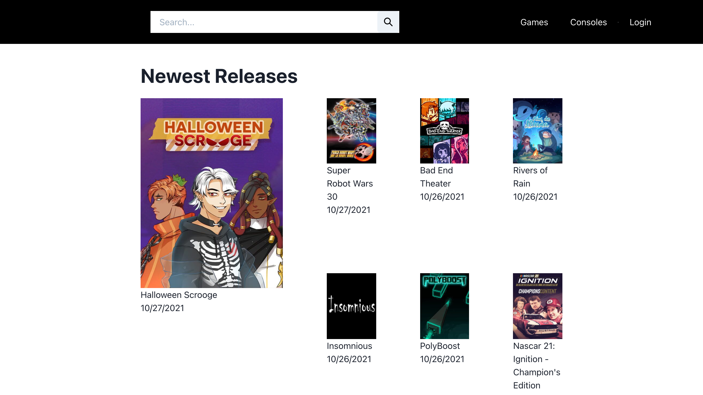
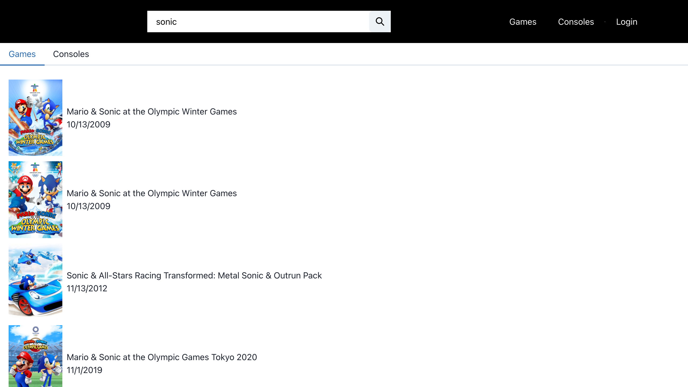
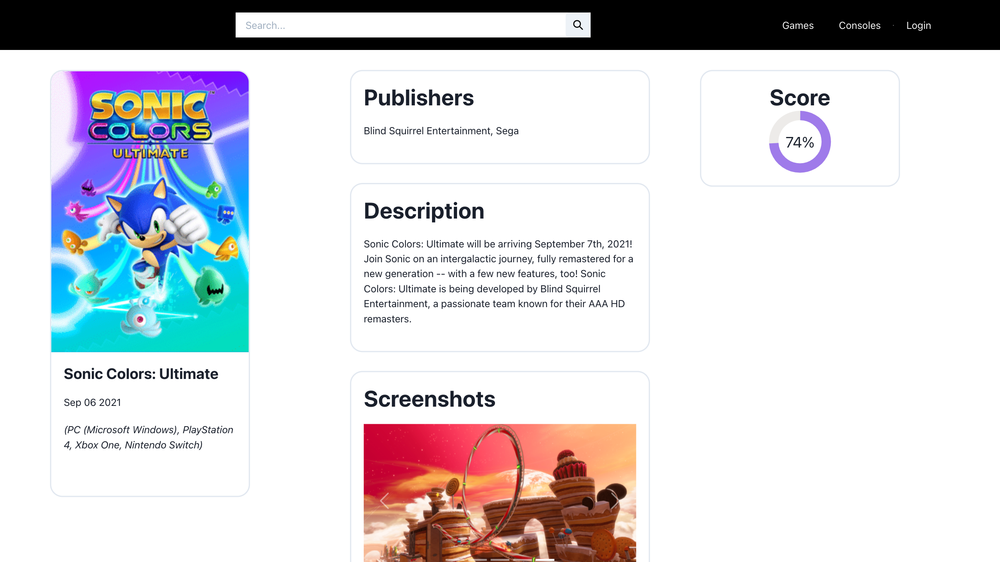
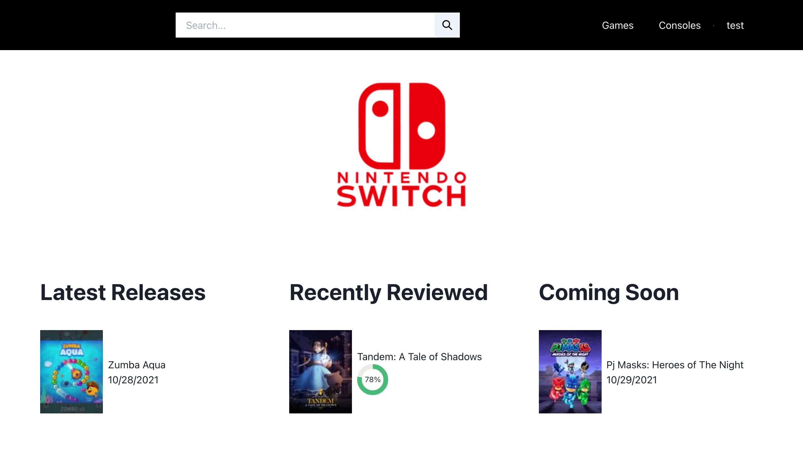
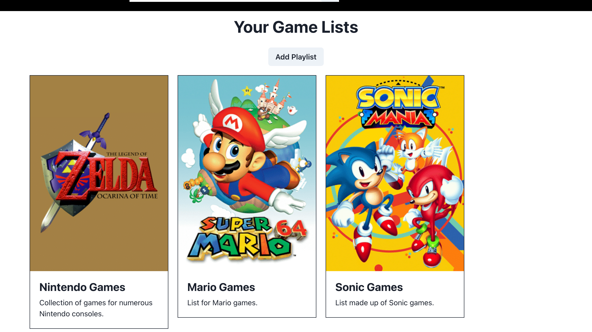
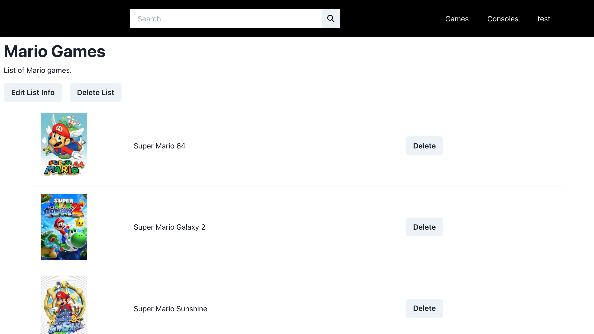

# Gamer Site


A site that utilizes the IGDB API to view games, along with details and information about each game.


## Documentation

* [Users](#users)
* [Developers](#developers)


## Users

You can view this web application [here](https://gamer-site.herokuapp.com/).

_(**Note**: This application uses cookies. If you don't want to use cookies, please refrain from using the account login feature.)_


### Viewing Games

You can view games that been newly released, have been top rated, and that are coming soon.



Games or consoles can be searched for through the top search bar.



Games and consoles will have their own pages containing some information about the specified game or console.





### Game Lists

You can create an account on this platform to create lists made up of games you choose to add to them.






## Developers

####Prerequisites
* [Node](https://nodejs.org/en/download/)
* [PostgreSQL](https://www.postgresql.org/download/)
* A [Twitch](https://www.twitch.tv/) account to use the [IGDB](https://www.igdb.com/discover) API

<br>

#### Running

After cloning this repo, be sure to run `npm install` in both the frontend and backend directories before running this application locally.


Before running the application, create a `.env` file in the root of the `backend` folder containing your Twitch client and secret keys and other information. The file should look something like this:

```
DATABASE_URL=postgres:///(your local database name)
HASH_ROUNDS=(pick a number between 12 and 18)
SECRET_KEY=(whatever you want to call this)

TWITCH_CLIENT_ID=(whatever this is)
TWITCH_SECRET_KEY=(whatever this is)
TWITCH_GRANT_TYPE=client_credentials
TWITCH_TOKEN=(whatever this is)

```

For setting up some of the Twitch fields, there's more on that [here](https://api-docs.igdb.com/#account-creation). 

_(Keep in mind that when you generate an IGDB API token, it'll last for 30 days before it expires, and you can only generate up to 25 tokens at a time! So be careful when generating a token.)_

<br>

Once you've set that up, you'll be able to run this application. You'll need to run commands from both the frontend and backend diectories in order to do this.

In the `frontend` directory,

```npm run start```


In the `backend/src` directory,

```node server```

or if you have nodemon installed...

```nodemon server```

<br>

#### Unit Testing

In order to unit test this application, you need to run tests separately on both the frontend and backend.

To test the backend, type

```npm test -- --runInBand```

in the `frontend` or `backend` directory.

For frontend testing, you'll need to create a `.env` file within the `frontend` folder containing this:

```
SKIP_PREFLIGHT_CHECK=true
```

before running the tests.

